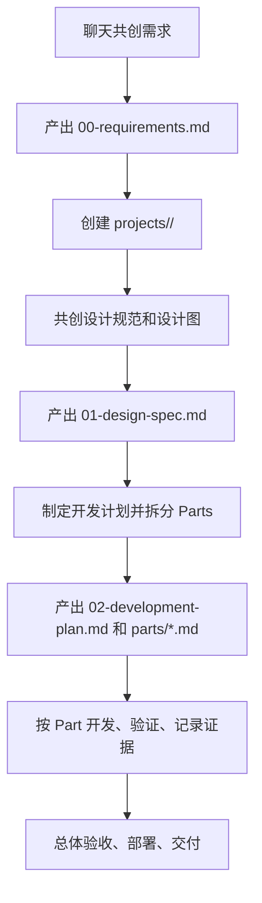

# agent-workflow-pack

一个面向 Codex、Claude Code、Claude Codex 等 Agent 开发工具的项目工作流包。

它的目标不是提供某个业务项目的代码，而是为未来的项目开发提供一套可复用的团队协作流程：先和用户共创需求，再沉淀设计规范和开发计划，最后按独立 Part 逐步实现、验证和交付。

## What It Solves

很多 Agent 项目会直接从一句需求跳进代码实现，导致范围不清、设计缺失、任务难拆、多人协作冲突、后续 Agent 接手困难。

本工作流包把项目开发拆成清晰阶段，并强制保存关键产物：

- 需求文档：项目名称、目标用户、功能范围、验收标准。
- 设计规范：页面结构、交互流程、视觉方向、设计图和可访问性要求。
- 开发计划：技术方案、任务拆分、依赖关系、验证策略。
- Part 文档：每个独立开发单元的范围、状态、证据和交接记录。

## Core Workflow



## Project Lifecycle

1. **Requirement Co-Creation**
   - Agent 通过聊天、skills 和 plugins 与用户反复澄清项目。
   - 必须明确项目名称、项目目标、用户角色、核心功能、详细需求、验收标准、约束和风险。
   - 产物：`projects/<project-slug>/00-requirements.md`

2. **Project Folder Initialization**
   - 在仓库根目录创建 `projects/<project-slug>/`。
   - 初始化 `parts/`、`decisions/`、`evidence/`。

3. **Design Specification**
   - 与用户共同确认信息架构、页面结构、交互流程、视觉方向、组件规范、响应式策略和可访问性要求。
   - 产物：`projects/<project-slug>/01-design-spec.md`

4. **Development Planning**
   - 将项目拆成多个可独立完成的 Part，支持多人或多 Agent 异步协作。
   - 每个 Part 都要有目标、范围、依赖、验收标准、负责角色和验证方式。
   - 产物：`projects/<project-slug>/02-development-plan.md` 和 `projects/<project-slug>/parts/*.md`

5. **Part-By-Part Implementation**
   - 每次只执行一个明确 Part，或执行多个没有共享写入冲突的 Part。
   - 每个 Part 完成后必须更新状态、变更摘要、验证证据、风险和后续事项。

6. **Delivery**
   - 完成总体验收、安全复核、部署、回滚说明和最终交接。

## Repository Structure

```text
.
├── .claude/
│   ├── CLAUDE.md                 # 顶层项目经理规则
│   ├── MANIFEST.md               # agents / skills / plugins 来源和维护清单
│   ├── agents/                   # 复合子 Agent 岗位定义
│   ├── plugins/                  # 项目级插件副本
│   ├── skills/                   # 项目级 skills
│   └── templates/
│       └── project/              # 需求、设计、计划、Part 模板
├── .gitattributes
├── .gitignore
└── README.md
```

生成项目时，Agent 应创建：

```text
projects/<project-slug>/
├── 00-requirements.md
├── 01-design-spec.md
├── 02-development-plan.md
├── parts/
│   └── part-001-<short-name>.md
├── decisions/
└── evidence/
```

## Built-In Agents

本工作流包把项目团队压缩为 5 个复合子 Agent，避免过度细分：

| Agent | Responsibility |
| --- | --- |
| `product-docs-lead` | 需求、范围、验收标准、README、发布说明、交接材料 |
| `solution-architect` | 架构、模块边界、接口、数据流、任务拆解、工程取舍 |
| `implementation-engineer` | 前端、后端、数据、API、UI、业务逻辑、迁移和集成实现 |
| `quality-security-engineer` | 测试、回归、验收、缺陷复现、代码审查、安全风险 |
| `delivery-ops-engineer` | 环境、CI/CD、部署、监控、运行手册、发布和回滚 |

## Built-In Plugins

| Plugin | Purpose |
| --- | --- |
| `superpowers` | 需求澄清、设计计划、TDD、系统化调试、并行 Agent、代码评审、分支收尾 |
| `github` | PR、Issue、CI、GitHub Actions、评论处理和发布前协作 |

## Built-In Skills

主要能力包括：

- UI/UX：`ui-ux-pro-max`、`figma-use`、`figma-generate-design`、`figma-implement-design`
- 浏览器验证：`playwright`、`playwright-interactive`、`screenshot`
- 安全：`security-best-practices`、`security-threat-model`、`security-ownership-map`
- 部署：`vercel-deploy`、`netlify-deploy`、`cloudflare-deploy`、`render-deploy`
- 文档和分析：`openai-docs`、`jupyter-notebook`、`pdf`

## Templates

项目产物模板位于 `.claude/templates/project/`：

| Template | Target |
| --- | --- |
| `00-requirements.template.md` | `projects/<project-slug>/00-requirements.md` |
| `01-design-spec.template.md` | `projects/<project-slug>/01-design-spec.md` |
| `02-development-plan.template.md` | `projects/<project-slug>/02-development-plan.md` |
| `part.template.md` | `projects/<project-slug>/parts/part-001-<short-name>.md` |

## Operating Rules

- 进入正式代码开发前，必须先完成需求文档、设计规范和开发计划。
- 后续所有任务都必须读取并遵循项目文件夹中的核心产物。
- 如果插件已经包含某个 skill，不在 `.claude/skills` 中重复保存。
- 优先使用市场、curated 或经过验证的第三方 skills，不重新发明通用流程。
- 每个 Part 必须记录验证证据，不能只写“已完成”。

## Quick Start For Agents

当 Agent 在本仓库中启动时：

1. 先读取 `.claude/CLAUDE.md`。
2. 按任务类型选择 `.claude/agents` 中的主责角色。
3. 使用 `.claude/plugins` 和 `.claude/skills` 中的成熟能力。
4. 新项目从 `.claude/templates/project/` 复制模板到 `projects/<project-slug>/`。
5. 按生命周期逐步推进，不跳过阶段门禁。

## Maintenance

维护规则记录在 `.claude/MANIFEST.md`。

更新 agents、skills、plugins 或 templates 后，应同步更新：

- `.claude/CLAUDE.md`
- `.claude/MANIFEST.md`
- `.claude/agents/README.md`
- `.claude/skills/README.md`
- `.claude/plugins/README.md`
- `README.md`

安装新的 skill 或 plugin 后，建议重启 Codex，让运行环境重新发现能力。
