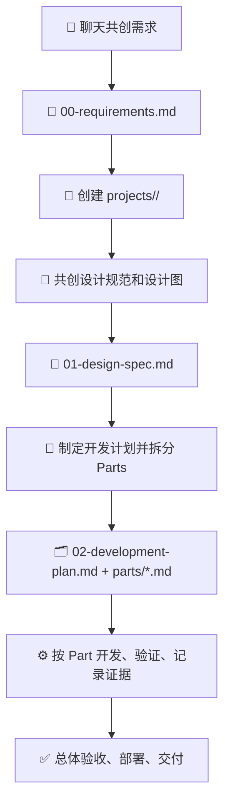

# agent-workflow-pack 🚀

面向 Codex、Claude Code、Claude Codex 等 Agent 开发工具的项目工作流包。

它不是一个业务项目模板，而是一套“让 Agent 像项目团队一样工作”的协作框架：先和用户充分讨论需求，再沉淀设计规范和开发计划，最后按可独立交付的 Part 逐步开发、验证和交付。

## ✨ Why This Exists

很多 Agent 项目会从一句模糊需求直接进入代码实现。短期看很快，长期会带来几个典型问题：

- 需求范围不清，后续频繁返工。
- 没有设计规范，UI、交互和技术方案容易漂移。
- 开发任务没有拆分，难以多人或多 Agent 异步协作。
- 缺少验证证据，无法判断某个阶段是否真正完成。
- 下一个 Agent 接手时，必须重新理解上下文。

`agent-workflow-pack` 通过固定项目生命周期和产物格式，把这些隐性协作成本前置解决。

## 🧭 Core Idea

每个项目都先形成 3 份核心文档，再进入正式开发：

| Artifact | Purpose |
| --- | --- |
| `00-requirements.md` | 明确项目名称、目标用户、功能范围、详细需求、约束和验收标准 |
| `01-design-spec.md` | 明确信息架构、页面结构、交互流程、视觉方向、设计图和可访问性要求 |
| `02-development-plan.md` | 明确技术方案、Part 拆分、依赖关系、协作方式和验证策略 |

之后的所有开发任务，都必须遵循这 3 份文档和 `.claude/CLAUDE.md` 中的工作流规则。

## 🔁 Workflow



## 🧱 Project Lifecycle

### 1. Requirement Co-Creation

Agent 通过聊天、skills 和 plugins 与用户反复澄清项目。目标不是“问几个问题”，而是把项目从想法整理成可验收的需求。

必须明确：

- 项目名称和项目目标
- 目标用户和核心场景
- 核心功能和非目标
- 详细需求和优先级
- 约束、风险和验收标准

产物：`projects/<project-slug>/00-requirements.md`

### 2. Project Folder Initialization

需求文档确认后，Agent 在仓库根目录创建项目文件夹：

```text
projects/<project-slug>/
├── 00-requirements.md
├── parts/
├── decisions/
└── evidence/
```

### 3. Design Specification

Agent 继续与用户讨论产品结构和设计规范，直到交互、视觉和页面组织方式足够清晰。

重点包括：

- 信息架构和页面清单
- 用户流程和关键状态
- 视觉方向、组件规范和布局密度
- 响应式策略和可访问性要求
- Mermaid 图、Figma 链接、截图或其他可复查设计图

产物：`projects/<project-slug>/01-design-spec.md`

### 4. Development Planning

Agent 基于需求和设计制定开发计划，把项目拆成多个可以独立完成的 Part。

每个 Part 必须说明：

- 目标和范围
- 依赖关系
- 输入和输出
- 负责角色
- 验收标准
- 验证方式

产物：

- `projects/<project-slug>/02-development-plan.md`
- `projects/<project-slug>/parts/*.md`

### 5. Part-By-Part Implementation

开发阶段按 Part 推进。每次只执行一个明确 Part，或执行多个没有共享写入冲突的 Part。

每个 Part 完成时必须记录：

- 状态变化
- 变更摘要
- 验证命令或人工检查
- 截图、日志或测试结果
- 风险和后续事项

### 6. Delivery

全部 Part 完成后，进入总体验收、部署和交接。

交付阶段应包含：

- 功能验收
- 安全复核
- 浏览器或截图证据
- 部署说明
- 回滚说明
- 最终交接记录

## 📂 Repository Structure

```text
.
├── .claude/
│   ├── CLAUDE.md                 # 顶层项目经理规则
│   ├── MANIFEST.md               # agents / skills / plugins 来源和维护清单
│   ├── agents/                   # 复合子 Agent 岗位定义
│   ├── plugins/                  # 项目级插件副本
│   ├── skills/                   # 项目级 skills
│   └── templates/
│       └── project/              # 需求、设计、计划、Part 模板
├── .gitattributes
├── .gitignore
└── README.md
```

生成项目时，Agent 应创建：

```text
projects/<project-slug>/
├── 00-requirements.md
├── 01-design-spec.md
├── 02-development-plan.md
├── parts/
│   └── part-001-<short-name>.md
├── decisions/
└── evidence/
```

## 👥 Built-In Agents

本工作流包把项目团队压缩为 5 个复合子 Agent，避免过度细分，同时保留真实项目开发所需的关键视角。

| Agent | Responsibility |
| --- | --- |
| `product-docs-lead` | 需求、范围、验收标准、README、发布说明、交接材料 |
| `solution-architect` | 架构、模块边界、接口、数据流、任务拆解、工程取舍 |
| `implementation-engineer` | 前端、后端、数据、API、UI、业务逻辑、迁移和集成实现 |
| `quality-security-engineer` | 测试、回归、验收、缺陷复现、代码审查、安全风险 |
| `delivery-ops-engineer` | 环境、CI/CD、部署、监控、运行手册、发布和回滚 |

## 🔌 Built-In Plugins

| Plugin | Purpose |
| --- | --- |
| `superpowers` | 需求澄清、设计计划、TDD、系统化调试、并行 Agent、代码评审、分支收尾 |
| `github` | PR、Issue、CI、GitHub Actions、评论处理和发布前协作 |

## 🧰 Built-In Skills

| Area | Skills |
| --- | --- |
| UI/UX | `ui-ux-pro-max`, `figma-use`, `figma-generate-design`, `figma-implement-design` |
| Browser verification | `playwright`, `playwright-interactive`, `screenshot` |
| Security | `security-best-practices`, `security-threat-model`, `security-ownership-map` |
| Deployment | `vercel-deploy`, `netlify-deploy`, `cloudflare-deploy`, `render-deploy` |
| Docs and analysis | `openai-docs`, `jupyter-notebook`, `pdf` |

## 📝 Templates

项目产物模板位于 `.claude/templates/project/`。

| Template | Target |
| --- | --- |
| `00-requirements.template.md` | `projects/<project-slug>/00-requirements.md` |
| `01-design-spec.template.md` | `projects/<project-slug>/01-design-spec.md` |
| `02-development-plan.template.md` | `projects/<project-slug>/02-development-plan.md` |
| `part.template.md` | `projects/<project-slug>/parts/part-001-<short-name>.md` |

## 🚦 Operating Rules

- 进入正式代码开发前，必须先完成需求文档、设计规范和开发计划。
- 后续所有任务都必须读取并遵循项目文件夹中的核心产物。
- 如果插件已经包含某个 skill，不在 `.claude/skills` 中重复保存。
- 优先使用市场、curated 或经过验证的第三方 skills，不重新发明通用流程。
- 每个 Part 必须记录验证证据，不能只写“已完成”。

## ⚡ Quick Start For Agents

当 Agent 在本仓库中启动时：

1. 读取 `.claude/CLAUDE.md`。
2. 根据任务类型选择 `.claude/agents` 中的主责角色。
3. 使用 `.claude/plugins` 和 `.claude/skills` 中的成熟能力。
4. 复制 `.claude/templates/project/` 中的模板到 `projects/<project-slug>/`。
5. 按生命周期逐步推进，不跳过阶段门禁。

## 🛠️ Maintenance

维护规则记录在 `.claude/MANIFEST.md`。

更新 agents、skills、plugins 或 templates 后，应同步更新：

- `.claude/CLAUDE.md`
- `.claude/MANIFEST.md`
- `.claude/agents/README.md`
- `.claude/skills/README.md`
- `.claude/plugins/README.md`
- `README.md`

安装新的 skill 或 plugin 后，建议重启 Codex，让运行环境重新发现能力。
